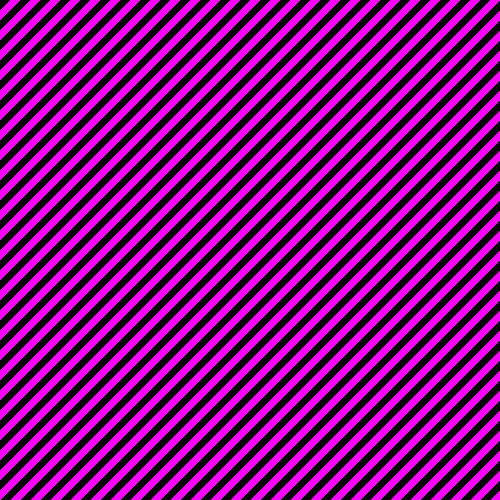

# quickimg

I made this so I could make a checkerboard texture for testing my graphics pipeline, but you can use this as a quick and easy way to generate any image programmatically. Here are the attempts:

1. The vertical stripes

2. The diagonal stripes

3. ????

And finally...

4. The checkerboard

